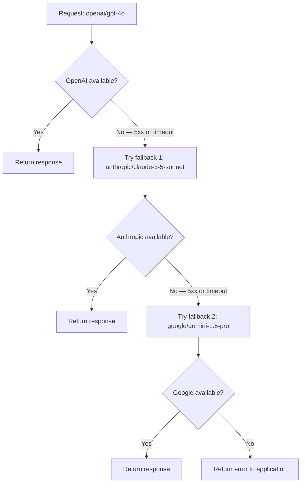

Inferoute can automatically retry a failed request against one or more backup providers before returning an error to your application. This means a provider outage, timeout, or rate limit at the primary provider doesn't have to cause a visible failure for your users. This guide explains how fallback routing works and how to configure it.

## Default behavior

By default, Inferoute does not apply fallback routing — if the targeted provider returns a `5xx` error or times out, the error is returned to your application immediately. To enable fallback, you configure a prioritized list of backup models at the request level using the `X-Inferoute-Fallback` header.

When a primary request fails, Inferoute:

1. Detects the `5xx` response or connection timeout from the primary provider
2. Selects the next model from your fallback list
3. Replays the original request payload to the backup provider
4. Returns the successful response to your application as if it came from the primary

The entire process is transparent — your application receives a standard chat completion response with no additional handling required.

<Note>
  Fallback does not change how you are billed. You are charged for the provider that actually served the request, at that provider's token rate. If your primary provider fails after processing tokens, you are not charged for that failed attempt.
</Note>

## Configure fallback with the request header

Pass a comma-separated list of fallback models in the `X-Inferoute-Fallback` request header. Inferoute tries them in order until one succeeds.

```
X-Inferoute-Fallback: anthropic/claude-3-5-sonnet,google/gemini-1.5-pro
```

<CodeGroup>

```python python
from openai import OpenAI

client = OpenAI(
    api_key="th-your-api-key",
    base_url="https://api.inferoute.ai/v1",
)

response = client.chat.completions.create(
    model="openai/gpt-4o",
    messages=[
        {"role": "user", "content": "Summarize the key points of the attached document."},
    ],
    extra_headers={
        "X-Inferoute-Fallback": "anthropic/claude-3-5-sonnet,google/gemini-1.5-pro",
    },
)

print(response.choices[0].message.content)
```

```javascript node.js
import OpenAI from "openai";

const client = new OpenAI({
  apiKey: "th-your-api-key",
  baseURL: "https://api.inferoute.ai/v1",
});

const response = await client.chat.completions.create(
  {
    model: "openai/gpt-4o",
    messages: [
      {
        role: "user",
        content: "Summarize the key points of the attached document.",
      },
    ],
  },
  {
    headers: {
      "X-Inferoute-Fallback": "anthropic/claude-3-5-sonnet,google/gemini-1.5-pro",
    },
  }
);

console.log(response.choices[0].message.content);
```

```bash curl
curl https://api.inferoute.ai/v1/chat/completions \
  -H "Authorization: Bearer th-your-api-key" \
  -H "Content-Type: application/json" \
  -H "X-Inferoute-Fallback: anthropic/claude-3-5-sonnet,google/gemini-1.5-pro" \
  -d '{
    "model": "openai/gpt-4o",
    "messages": [
      {"role": "user", "content": "Summarize the key points of the attached document."}
    ]
  }'
```

</CodeGroup>

## Identify which provider served the request

Even when fallback is transparent, you may want to log which provider handled each request for cost attribution or debugging. Every response from Inferoute includes an `X-Inferoute-Provider` response header.

```python python
import httpx
from openai import OpenAI

# Use the httpx client to access raw response headers
http_client = httpx.Client()

client = OpenAI(
    api_key="th-your-api-key",
    base_url="https://api.inferoute.ai/v1",
    http_client=http_client,
)

with client.chat.completions.with_raw_response.create(
    model="openai/gpt-4o",
    messages=[{"role": "user", "content": "Hello"}],
    extra_headers={
        "X-Inferoute-Fallback": "anthropic/claude-3-5-sonnet",
    },
) as raw_response:
    provider = raw_response.headers.get("X-Inferoute-Provider")
    response = raw_response.parse()

print(f"Served by: {provider}")
print(response.choices[0].message.content)
```

## Fallback routing flow



## Choosing your fallback models

<Warning>
  Fallback models should have capabilities comparable to your primary model. If your primary prompt relies on a 200k context window or function calling support, ensure your fallback models support the same features. Routing to a model that lacks a required capability will result in an error or degraded output, not a transparent fallback.
</Warning>

When building your fallback list, consider:

- **Capability parity** — if your request uses tools, vision, or structured outputs, all fallback models must support those features
- **Context length** — if your prompt is 50k tokens, every fallback model must support at least that context window
- **Output consistency** — models from different providers have different writing styles and behavior; test fallback models on your prompts before deploying
- **Cost implications** — a fallback to a more expensive model increases cost when triggered; factor this into your budget

### Recommended fallback pairs

| Primary | Fallback |
|---|---|
| `openai/gpt-4o` | `anthropic/claude-3-5-sonnet,google/gemini-1.5-pro` |
| `anthropic/claude-3-5-sonnet` | `openai/gpt-4o,google/gemini-1.5-pro` |
| `openai/gpt-4o-mini` | `anthropic/claude-3-haiku,google/gemini-flash` |
| `google/gemini-flash` | `openai/gpt-4o-mini,anthropic/claude-3-haiku` |
